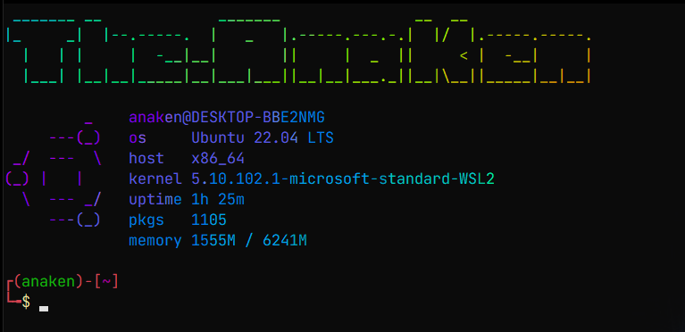
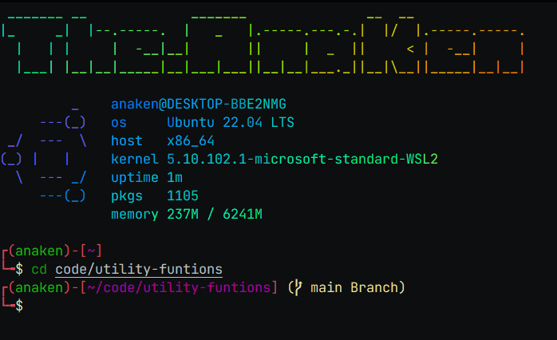

# Contents

-   [About](#utility-files)
-   [Installation:](#Installation)

    -   [Clone Repo](#clone-it-using-git)
    -   [Figlet Fonts](#install-figlet-fonts)

-   [Zshell:](#zshell)
    -   [Zshell ScreenShot](#zshell-screenshots)
    -   [Dependencies Required](#dependencies-required)
    -   [Try Zshell](#try-zshell)
    -   [Change default shell to zsh](#change-your-default-shell-to-zsh-linux)
-   [Change figlet text art](#change-figlet-text-art)

-   [Support Email](#support)

# Utility Files

A repo consisting of the .zshrc file I personally use

## Installation

### Clone it using git

```bash
git clone https://github.com/theAnaKen/utility-funtions.git &&
cd utility-funtions/
```

### Install figlet fonts

[GitHub](https://github.com/xero/figlet-fonts.git)

```bash
git clone https://github.com/xero/figlet-fonts.git
cd figlet-fonts
sudo mv * /usr/share/figlet/
cd ..
rm -rf figlet-fonts
```

# Zshell:

It is mostly contributed by [him](https://github.com/jakbin/myzsh.git)

### The Zshell look after using [zshrc](zshrc/zshrc)

## Zshell Screenshots:

### Normally:



### In a Git dir:



### Dependencies required

-   lolcat
-   pfetch
-   figlet
-   zsh
-   zsh-syntax-highlighting
-   zsh-autosuggestions

### Try Zshell

```bash
zsh
```

## Change your default shell to zsh (linux)

```bash
chsh
*input root password*
/bin/zsh
*reboot system*
```

### Change figlet Text art

change the name variable in [zshrc](zshrc/zshrc) at line 1

## Support

For support, email the.anaken@gmail.com .
